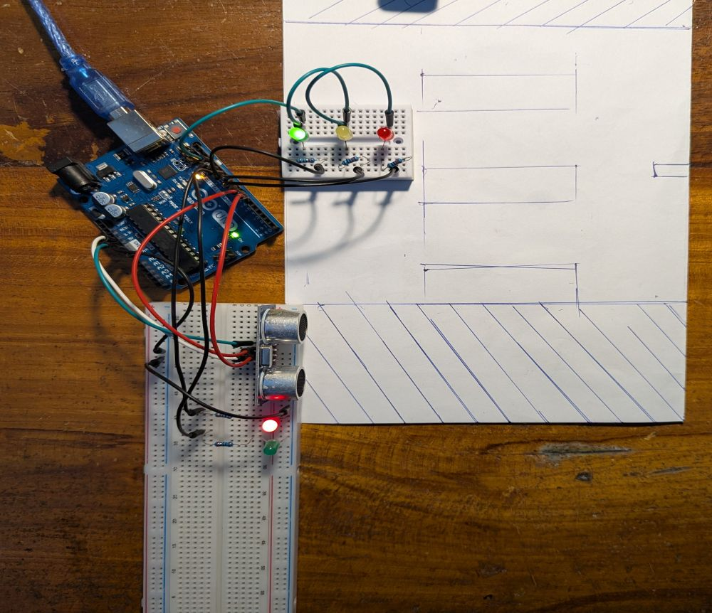
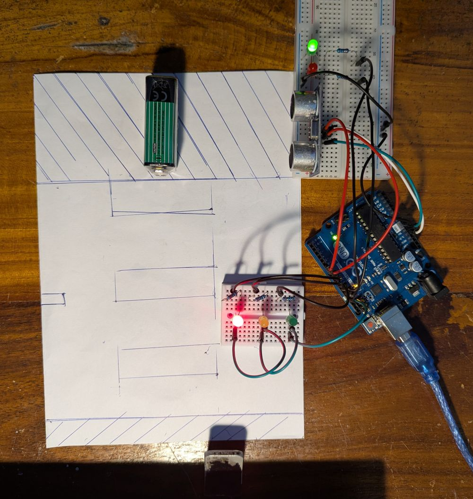

# Smart Pedestrian Traffic Light

A robust, real-world traffic light system for vehicles and pedestrians, implemented in both Arduino (.ino) and bare-metal AVR-C (.c) for ATmega328P. This project demonstrates advanced embedded design, sensor integration, and state machine logic.

---

## Features
- **Ultrasonic pedestrian detection** (HC-SR04)
- **5-state finite state machine** for safe, realistic traffic control
- **Non-blocking timing** (custom millis in C, Arduino millis in .ino)
- **False trigger prevention** (median filter in Arduino, hysteresis in C)
- **Precise echo timing** (hardware interrupt in C, pulseIn in Arduino)
- **Explicit LED control** in every state
- **Portable pin mappings** (same for both versions)

---

## Hardware Connections
| Signal      | Arduino Pin | AVR Port/Bit | Description                |
|-------------|-------------|--------------|----------------------------|
| TRIG        | D6          | PD6          | Ultrasonic trigger         |
| ECHO        | D7 (Arduino)| D2 (C, INT0) | Ultrasonic echo (INT0 in C)|
| CAR_RED     | D8          | PB0          | Car red LED                |
| CAR_YELLOW  | D9          | PB1          | Car yellow LED             |
| CAR_GREEN   | D10         | PB2          | Car green LED              |
| PED_GREEN   | D11         | PB3          | Pedestrian green LED       |
| PED_RED     | D12         | PB4          | Pedestrian red LED         |

> **Note:** In the C version, ECHO must be on D2 (PD2, INT0) for hardware interrupt operation.

---

## How It Works
- **Pedestrian detection:**
	- Arduino: 3-sample median filter, blocking pulseIn
	- C: Hardware interrupt (INT0), non-blocking, hysteresis
- **State machine:**
	- VEHICLE_GREEN → VEHICLE_YELLOW → VEHICLE_RED → PEDESTRIAN_GREEN → VEHICLE_PRE_GREEN → VEHICLE_GREEN
	- Ensures minimum green/red times, safe transitions, and no flicker
- **Timing:**
	- Arduino: Uses built-in millis()
	- C: Custom millis() via Timer0 overflow ISR

---

## Build & Flash
### Arduino (.ino)
1. Open `TrafficLight.ino` in Arduino IDE or VS Code with Arduino extension
2. Select board and port
3. Upload

### Bare-metal AVR-C (.c)
```sh
avr-gcc -mmcu=atmega328p -DF_CPU=16000000UL -Os -std=c99 -o TrafficLight.elf TrafficLight.c
avr-objcopy -O ihex TrafficLight.elf TrafficLight.hex
avrdude -c arduino -p m328p -P COM3 -b 115200 -U flash:w:TrafficLight.hex
```
Adjust `-P COM3` as needed.

---

## Key Differences: Arduino vs. C
| Aspect                | Arduino (.ino)         | Bare-metal C (.c)         |
|-----------------------|------------------------|---------------------------|
| Pin control           | pinMode/digitalWrite   | Direct register (PORTx)   |
| Timing                | millis()               | Custom millis (Timer0 ISR)|
| Echo timing           | pulseIn (blocking)     | INT0 interrupt (non-block)|
| False trigger filter  | Median filter          | Hysteresis                |
| Portability           | Any Arduino board      | ATmega328P (AVR) only     |
| Code style            | High-level, easy       | Low-level, efficient      |

---

## Tips for Success
1. **INT0 Pin:** ECHO must use D2 (PD2) in C for hardware interrupts.
2. **Debouncing:** Hysteresis (C) and median filter (Arduino) prevent false triggers.
3. **Timing:** All delays are non-blocking; system remains responsive.
4. **Pin Mapping:** Both versions use the same pinout for easy hardware reuse.

---

## License
MIT License

---

*Project originally coded with Claude Sonnet 4.6, reviewed and improved for clarity and robustness. Contributions welcome!*

---

## Photos
Below are photos of the working system for reference:

|  |  |

These images show the real hardware setup and operation of the smart pedestrian traffic light.
